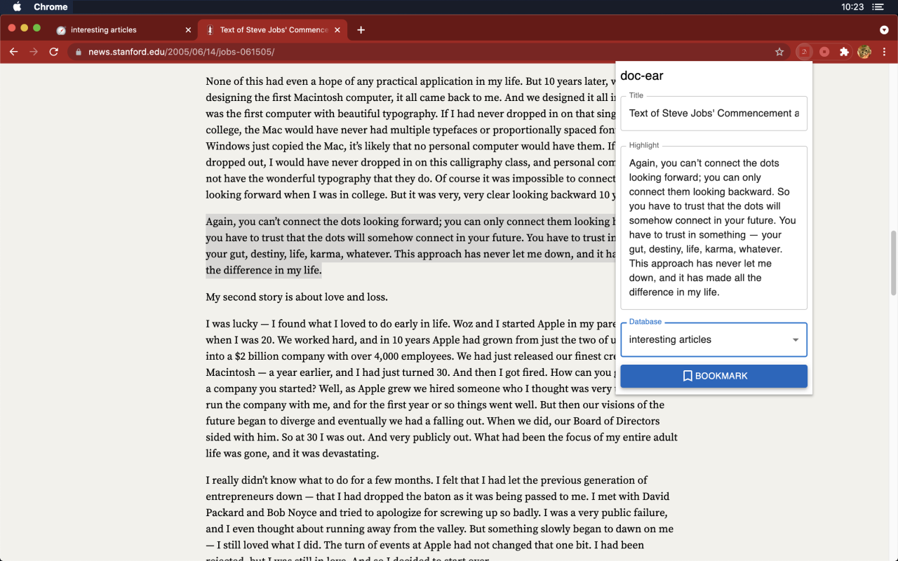
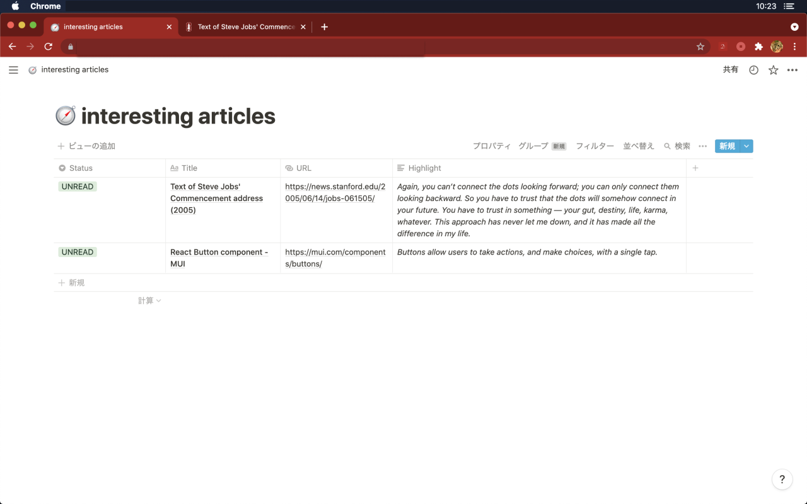

# doc-ear

You can save articles with a highlighted phrase.





## for User: Getting Started Documentation

- [日本語ドキュメント](./documents/README-ja.md)
- [Document in English](./documents/README-en.md)

## for Developpers

```bash
$ git clone https://github.com/hokekiyoo/doc-ear.git
$ npm install
$ npm run build
```
