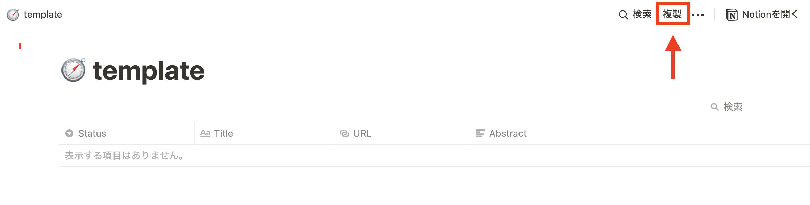
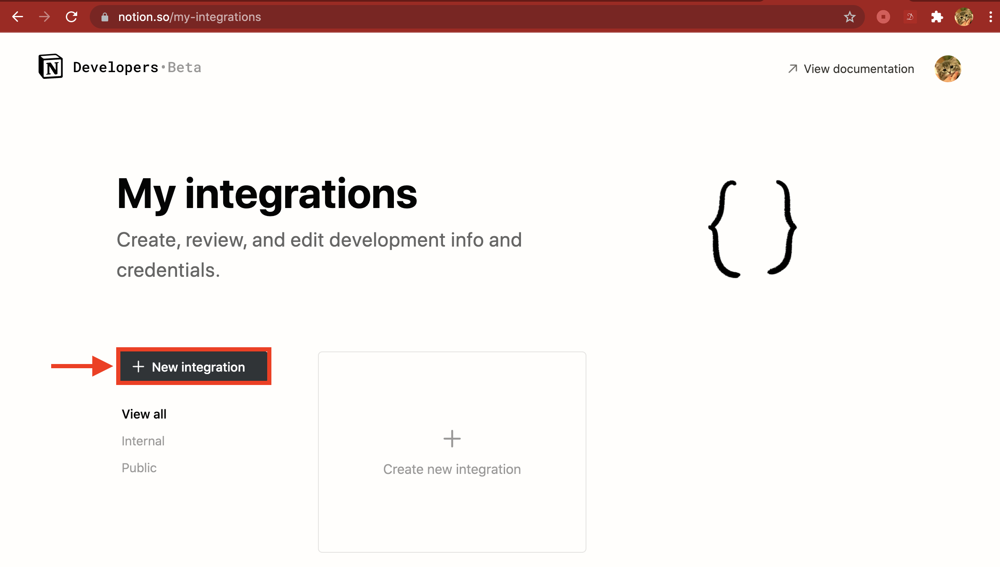
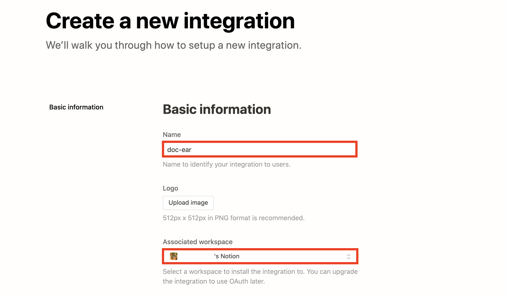
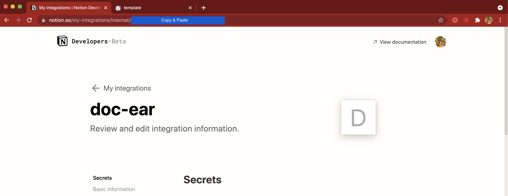
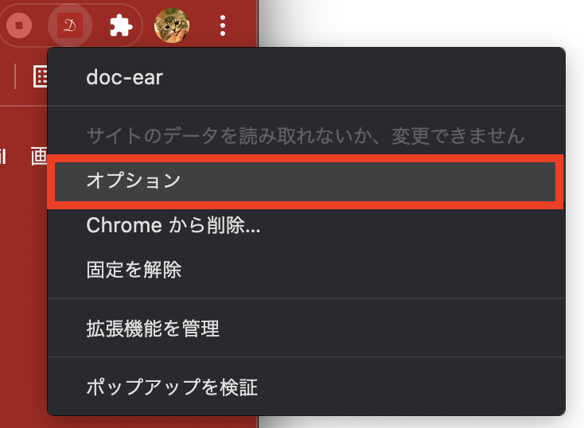
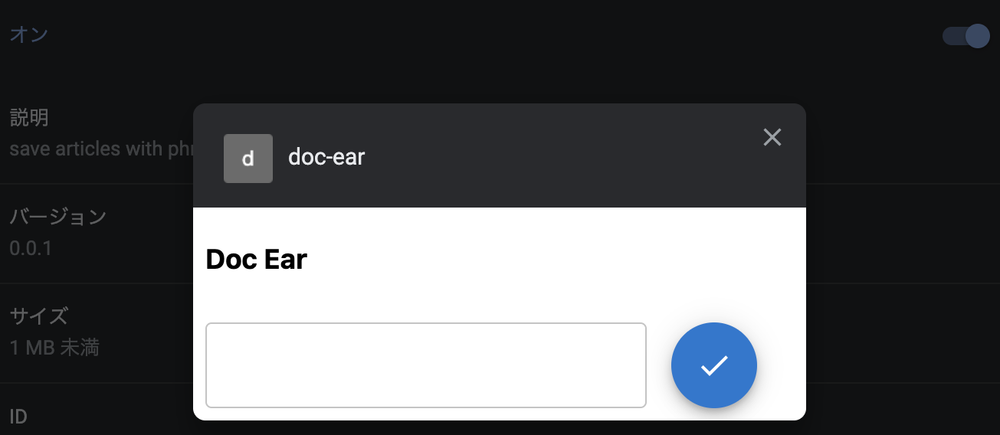
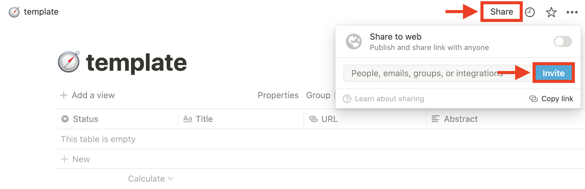
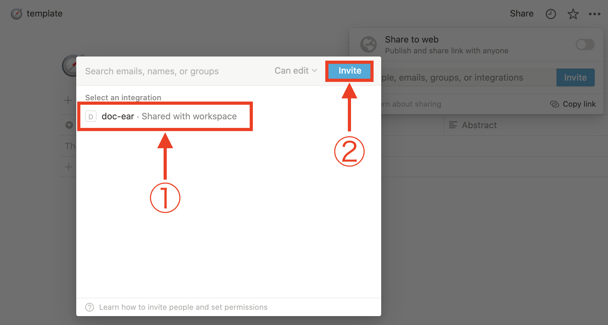
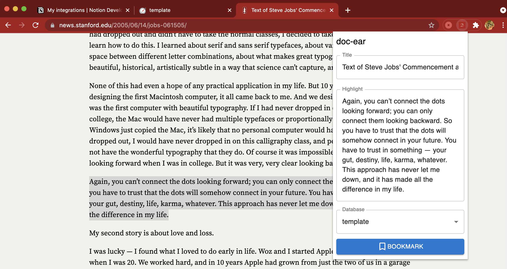
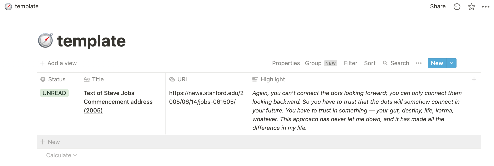

# doc-ear Getting Started

## 1. add chrome extension

navigate to [doc-ear extension](https://chrome.google.com/webstore/detail/doc-ear/ehnemnmbeciffbkhjhliocjhlgfhbdcm?hl=ja&authuser=0) and select `add chrome`

## 2. setup notion database page

Login to [notion](https://www.notion.so)

Duplilicate [this template page](https://www.notion.so/6b016c99ac6141f0ac8842891c0f6ced?v=d831c62a89e14794b250612650256890) to your own notion page

without template, make the database page with [this instruction](https://www.notion.so/guides/creating-a-database) and **precisely** set database properties following.

| property  | type   |
| --------- | ------ |
| Title     | Title  |
| URL       | URL    |
| Status    | Select |
| Highlight | Text   |

## 3. add Notion Integrations

Navigate to [My Integrations](https://www.notion.so/my-integrations) and push `add New Integrations`

input integration Name and select workspace

copy integration ID from page URL `https://www.notion.so/my-integrations/internal/xxxxxxxxxxxxxxxxxxxxxxxxxxxxxxxx` (32-digits)

right-click on doc-ear icon and select option

paste 32-digits ID and push check-marked button

## 4. integrate doc-ear into notion page

navigate to notion page created in `2` and push `Share` -> `Invite`

select integration created in `3` and push `Invite`

## 5. use doc-ear

select phrase you impressed in your article and push icon → `Bookmark`

the article is bookmarked with a selected phrase.

