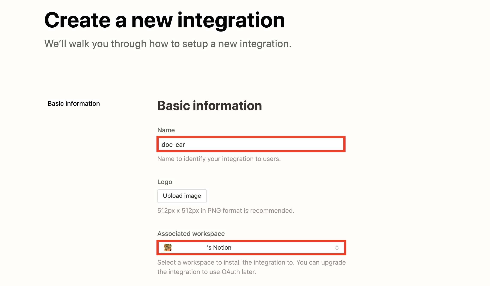
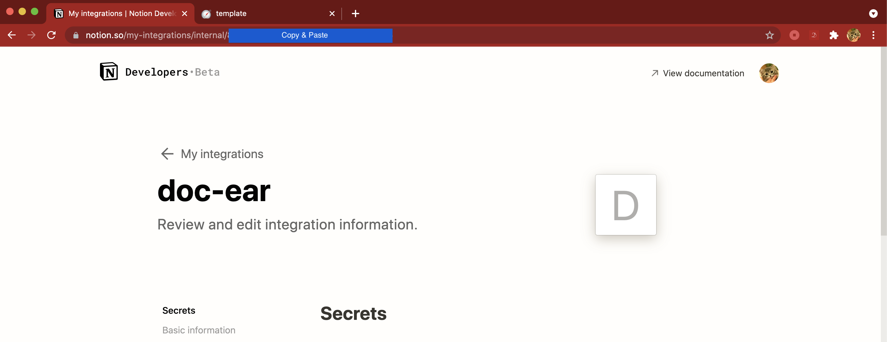
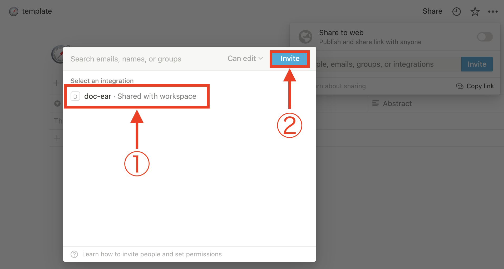

# doc-ear Getting Started

## 1. chrome 拡張を登録する

[doc-ear](https://chrome.google.com/webstore/detail/doc-ear/ehnemnmbeciffbkhjhliocjhlgfhbdcm?hl=ja&authuser=0)にアクセスし、`chromeに追加`を選択

## 2. notion ページのセットアップ

[notion](https://www.notion.so)にログイン

[テンプレートページ](https://www.notion.so/6b016c99ac6141f0ac8842891c0f6ced?v=d831c62a89e14794b250612650256890)自分の notion のページに複製する

- テンプレートを利用しない場合、notion 上に手作業で Databese のページを作る [作り方:notion](https://www.notion.so/guides/creating-a-database)
- 自分で作成する場合は、下記の property と type を正確に入力する

| property  | type   |
| --------- | ------ |
| Title     | Title  |
| URL       | URL    |
| Status    | Select |
| Highlight | Text   |

## 3. Notion Integrations の設定と登録

[My Integrations](https://www.notion.so/my-integrations)にアクセスし `add New Integrations`を押下

integration 名を入力(任意で良いが、拡張の名前が`doc-ear`なのでわかりやすさのために同じにしておくことを推奨します)し、ワークスペースを選択する

作った integration ページのアドレス`https://www.notion.so/my-integrations/internal/xxxxxxxxxxxxxxxxxxxxxxxxxxxxxxxx`の`xxxxxxxxxxxxxxxxxxxxxxxxxxxxxxxx`部分をコピーする

chrome 拡張を右クリックし、`オプション`を選択します

ポップアップが現れるので、そこに先程コピーした 32 桁の ID: `xxxxxxxxxxxxxxxxxxxxxxxxxxxxxxxx`をペーストし、✓ を押す

## 4. notion ページに doc-ear を integrate

`2`で作ったページに飛び、右上の`Share`を押下 →`Invite`を押下

`3`で作った integration を選択肢から選び、`Invite`を押下

## 5. 実行

web ページで気になるところを範囲選択し、doc-ear のアイコンを押下 →`Bookmark`を押下

notion ページに飛ぶと、選択した highlight と一緒に記事が登録されている

